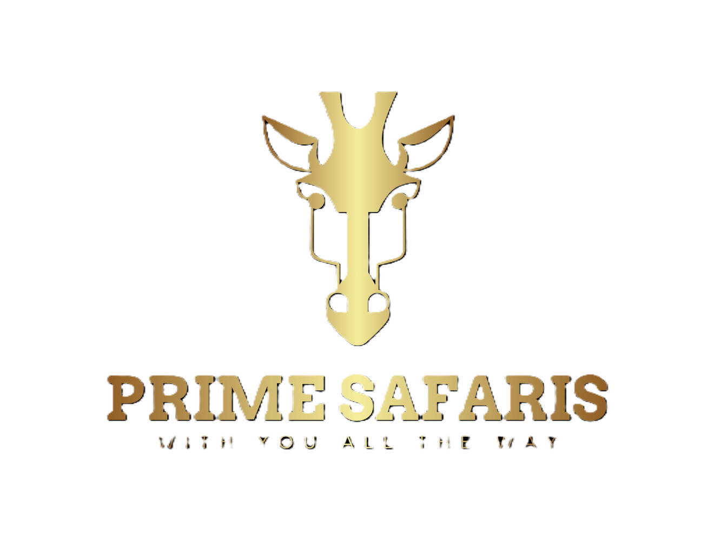
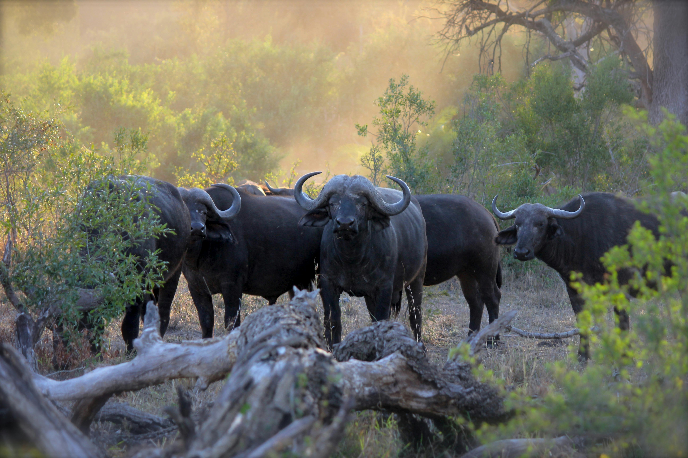
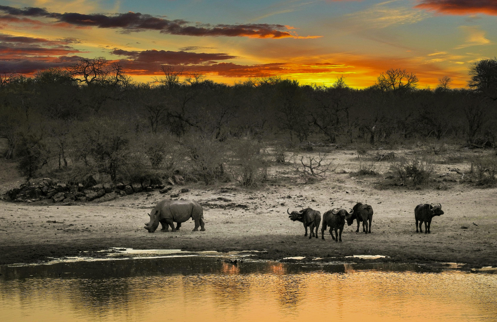

# home.html
<!DOCTYPE html>
<html lang="en">
  <head>
    <meta charset="UTF-8" />
    <meta name="viewport" content="width=device-width, initial-scale=1.0" />
    <title>Prime Safaris</title>
    <link rel="stylesheet" href="styles.css" />
  </head>
  <body>
    <header>
      
      <nav>
        <ul class="nav-links">
          <li><a href="home.html">Home</a></li>
          <li><a href="about.html">About</a></li>
          <li><a href="services.html">Services</a></li>
          <li><a href="contact.html">Contact Us</a></li>
        </ul>
      </nav>
    </header>

    <main>
      <section class="banner">
        
        
        
        
        
        
        
        
        
        
      </section>
      <section class="intro">
        <h1>Welcome to Prime Safaris</h1>
        

          Discover the Pearl of Africa with Prime Safaris. We offer exceptional
          gorilla trekking, wildlife safaris, cultural experiences, and luxury
          travel packages across Uganda. Experience nature, culture, and
          adventure like never before.
        

      </section>

      <section class="destinations">
        <h2>Top Safari Destinations in Uganda</h2>
        

          Uganda is home to 10 national parks, each offering unique experiences.
          Here are our top recommendations:
        

        <ol>
          <li>
            <strong>Bwindi Impenetrable National Park:</strong> World-famous for
            gorilla trekking.
          </li>
          <li>
            <strong>Murchison Falls National Park:</strong> Known for the
            majestic waterfall and diverse wildlife.
          </li>
          <li>
            <strong>Kibale Forest National Park:</strong> A primate haven,
            especially for chimpanzee tracking.
          </li>
          <li>
            <strong>Queen Elizabeth National Park:</strong> Best for boat
            safaris and rich biodiversity.
          </li>
          <li>
            <strong>Kidepo Valley National Park:</strong> Untouched wilderness
            and rare wildlife.
          </li>
          <li>
            <strong>Mgahinga Gorilla National Park:</strong> Gorilla and golden
            monkey trekking.
          </li>
          <li>
            <strong>Lake Mburo National Park:</strong> Small but full of life,
            especially zebras.
          </li>
        </ol>
      </section>

      <section class="packages">
        <h2>Why Travel with Prime Safaris?</h2>
        

          Our safari packages cater to all travelers and age groups. We
          prioritize your comfort, safety, and budget. Whether you're a solo
          traveler, student group, or large organization, we offer flexible,
          customized experiences — even with last-minute changes.
        

        
Our packages include:

        <ul>
          <li>Private and group safaris</li>
          <li>Gorilla & chimpanzee trekking</li>
          <li>Wildlife game drives</li>
          <li>Bird watching and nature walks</li>
          <li>Eco-lodge and sustainable tourism options</li>
        </ul>
      </section>

      <section class="culture">
        <h2>Discover Uganda’s Rich Culture</h2>
        

          Uganda is a vibrant tapestry of over 30 native languages and diverse
          cultural groups. Known for its friendly people and warm hospitality,
          Uganda offers an immersive cultural experience for all visitors.
        

      </section>

      <section class="sponsors">
        <h2>Our Trusted Partners</h2>
        

          
          
          
        

      </section>
    </main>

    <footer>
      

        <!-- Company Info -->
        

          <h4>About Prime Safaris</h4>
          

            Prime Safaris offers unforgettable safari experiences across Uganda
            — from gorilla trekking to cultural tours. We focus on eco-tourism,
            safety, and personalized travel.
          

        

        <!-- Quick Links -->
        

          <h4>Quick Links</h4>
          <ul>
            <li><a href="home.html">Home</a></li>
            <li><a href="about.html">About Us</a></li>
            <li><a href="services.html">Services</a></li>
            <li><a href="contact.html">Contact</a></li>
          </ul>
        

        <!-- Contact Info -->
        

          <h4>Contact Us</h4>
          
Email: info@primesafaris.com

          
Phone: +256 700 000 000

          
Location: Kampala, Uganda

        

        <!-- Social Media -->
        

          <h4>Follow Us</h4>
          

            <a href="#" aria-label="Facebook">🌐 Facebook</a> 
            <a href="#" aria-label="Instagram">📸 Instagram</a> 
            <a href="#" aria-label="Twitter">✖️ Twitter</a> 
          

        

      

      

        

          &copy; 2025 Prime Safaris. All rights reserved. |
          <a href="#">Privacy Policy</a> | <a href="#">Terms of Service</a>
        

      

    </footer>
  </body>
</html>
# myfirstwebsite.io
begining of my journey

# about.html
# services.html
# contact.html
# styles.css
